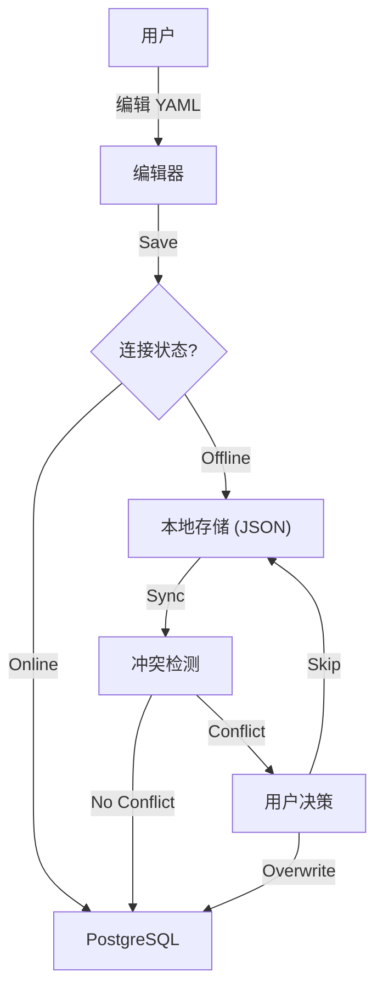

# Etymos Manager 开发文档

本文档旨在帮助开发人员和 AI 助手快速理解 `yaml2pg` (Etymos Manager) 项目的架构、功能和运行机制。

## 1. 目录结构介绍

项目位于 `tool/yaml2pg/` 目录下，采用前后端分离（但在同一 Express 服务中托管）的架构。

```text
tool/yaml2pg/
├── node/                   # 后端维护脚本 (初始化、迁移)
│   ├── init_db.js          # 数据库初始化脚本
│   └── migrate_v2.js       # 数据库迁移脚本 (v1 -> v2)
├── python/                 # Python 辅助工具 (旧版数据加载器)
├── web/                    # Web 应用主目录 (核心)
│   ├── controllers/        # 控制器层 (处理业务逻辑)
│   ├── data/               # 本地存储数据 (local_words.json)
│   ├── db/                 # 数据库连接池管理
│   ├── public/             # 静态资源 (前端代码)
│   │   ├── css/            # 样式表 (Tailwind + Custom)
│   │   ├── js/             # 前端逻辑
│   │   │   ├── modules/    # 功能模块 (编辑器、列表、预览、同步)
│   │   │   ├── api.js      # API 请求封装
│   │   │   ├── main.js     # 入口文件
│   │   │   └── state.js    # 全局状态管理
│   │   └── index.html      # 单页应用入口
│   ├── routes/             # Express 路由定义
│   ├── services/           # 服务层 (核心业务逻辑)
│   ├── localStore.js       # 本地 JSON 存储引擎
│   └── server.js           # 应用入口 (Express Server)
├── schema.sql              # 数据库结构定义
└── migration_v2.sql        # V2 版本迁移 SQL
```

## 2. Tool 介绍

**Etymos Manager** 是一个用于管理词源数据的 Web 工具。它允许用户通过 YAML 格式编写单词的深度解析（Yield, Etymology, Cognate, Application, Nuance），并将其保存到 PostgreSQL 数据库中。

### 核心特性
*   **YAML 编辑器**: 支持实时语法校验、自动格式化。
*   **双模存储**: 支持离线（本地 JSON）和在线（PostgreSQL）两种存储模式。
*   **同步机制**: 提供冲突检测、差异对比 (Diff) 和批量同步功能。
*   **预览功能**: 支持“精美卡片”和“Markdown 笔记”两种预览模式。
*   **响应式布局**: 带有可收起侧边栏的现代化 UI。

## 3. API 接口介绍

所有 API 均挂载在 `/api` 路径下。

### 3.1 核心与配置 (`/api`)
*   `GET /api/status`: 检查数据库连接状态。
*   `GET /api/config`: 获取服务器配置（如数据库连接串）。
*   `POST /api/config`: 更新服务器配置。

### 3.2 本地存储 (`/api/local`)
*   `GET /api/local`: 获取所有本地暂存的记录。
*   `POST /api/local`: 保存或更新本地记录。
    *   参数: `{ yaml, id, forceUpdate }`
    *   功能: 包含本地冲突检测（基于 Lemma）。
*   `DELETE /api/local/:id`: 删除指定 ID 的本地记录。

### 3.3 同步与检测 (`/api/sync`)
*   `POST /api/sync/check`: 批量检测冲突。
    *   输入: 本地记录列表。
    *   输出: 每条记录的状态（冲突、安全、错误）。
*   `POST /api/sync/execute`: 批量执行同步（写入 DB 并删除本地）。

### 3.4 单词管理 (`/api/words`)
*   `GET /api/words`: 获取数据库中的单词列表。
    *   支持参数: `page`, `limit`, `search`, `sort` (az, za, newest, oldest)。
*   `POST /api/words`: 保存单词到数据库。
*   `DELETE /api/words/:id`: 从数据库删除单词。

## 4. 项目运行流程

### 4.1 启动流程
1.  **环境准备**: 确保 Node.js 环境已安装，PostgreSQL 数据库可选（支持纯本地模式）。
2.  **依赖安装**: 在 `web/` 目录下运行 `npm install`。
3.  **服务启动**: 运行 `npm start` (执行 `node server.js`)。
    *   Express 服务器启动，监听端口 (默认 3000)。
    *   初始化 `localStore`，加载 `data/local_words.json`。
    *   尝试连接数据库（如果配置存在）。

### 4.2 数据流向图



### 4.3 前端架构
前端采用原生 JavaScript (ES Modules) 实现，无构建步骤，直接运行。

*   **入口**: `index.html` 加载 `js/main.js`。
*   **状态**: `js/state.js` 使用简单的 Store 模式管理全局状态（当前记录、分页、DB 连接）。
*   **路由**: 使用 `history.pushState` 实现简单的客户端路由（预览页、列表页切换）。
*   **渲染**: `js/modules/ui-render.js` 负责 DOM 操作和 HTML 生成。

## 5. 开发者指南

### 数据库 Schema
项目主要依赖 `WORDS` 表存储核心数据，结构定义见 `schema.sql`。
*   `id`: UUID
*   `lemma`: 单词原形 (Unique)
*   `raw_yaml`: 完整的 YAML 源数据
*   `created_at`, `updated_at`: 时间戳

### 关键文件说明
*   **`web/localStore.js`**: 实现了一个基于文件的简易数据库，支持 CRUD 操作，用于离线存储。
*   **`web/modules/preview.js`**: 包含卡片渲染和 Markdown 生成的核心逻辑，移植自 `yml2html` 工具。
*   **`web/modules/sync.js`**: 处理复杂的同步逻辑，包括批量冲突解决 UI。

### 调试建议
*   **前端**: 直接在浏览器控制台查看 `window.store` 可获取当前应用状态。
*   **后端**: 服务器日志会打印详细的 SQL 错误和 API 请求信息。
*   **数据**: 本地数据存储在 `web/data/local_words.json`，可直接查看或备份。
