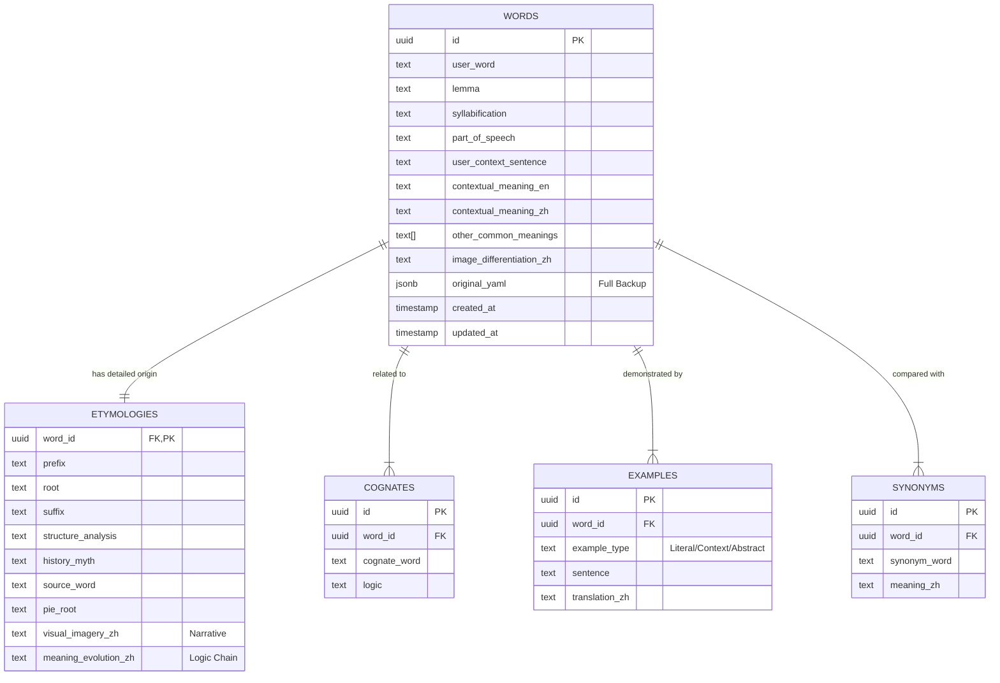

# YAML to PostgreSQL Schema Design

This document outlines the database schema designed to store complex etymological data parsed from YAML.

## Entity Relationship Diagram (Mermaid)

## Design Highlights

1.  **Normalization Strategy**:
    *   **1:1 Separation**: `Etymologies` are separated from `Words` to keep the main table efficient for listing/searching, while isolating the heavy text content (visual imagery narratives) in a dedicated table.
    *   **1:N Relations**: `Cognates`, `Examples`, and `Synonyms` are fully normalized into child tables to support arbitrary numbers of entries without schema changes.

2.  **PostgreSQL Optimizations**:
    *   **UUID Keys**: All tables use `UUID` primary keys (`gen_random_uuid()`) to support distributed architectures and safer data merging.
    *   **JSONB Audit**: The `words.original_yaml` column stores the raw input data. This "Schema-on-Read" backup allows us to re-parse data later if our logic changes, without losing the original source.
    *   **GIN Indexing**: Enabled on `original_yaml` (for arbitrary JSON queries) and `pie_root` (for text search on roots).

3.  **Security**:
    *   **Row Level Security (RLS)**: Enabled on all tables. Currently configured with a default "Public Read" policy, but ready for multi-tenant isolation (e.g., `auth.uid() = user_id`) when needed.
