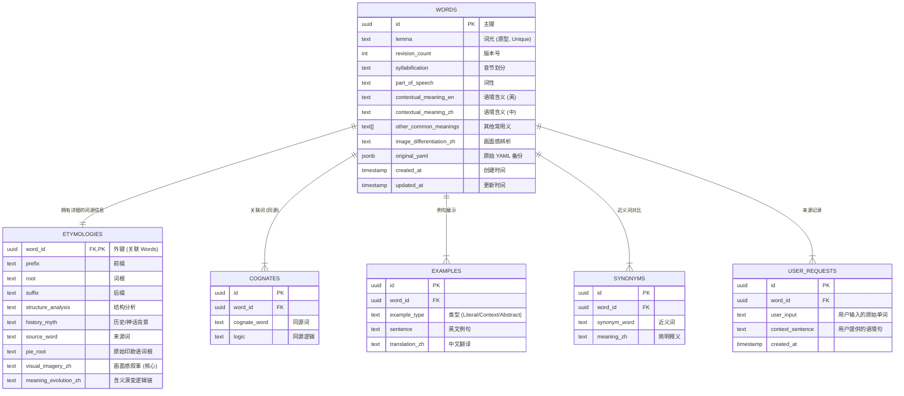

# Etymos Manager (YAML to PostgreSQL 工具)

这是一个全栈 Web 应用程序，专为管理、可视化和存储从 YAML 解析出的词源数据而设计。它是 Ad Fontes Prompts 生态系统中的“管理器 (Manager)”组件。

## 🌟 核心特性 (v1.2+)

### 1. 离线优先架构 (Offline-First)
*   **双重存储**：利用浏览器的 LocalStorage 实现无缝离线运行。
*   **同步引擎**：强大的同步逻辑，支持：
    *   **离线 -> 在线**：当连接到数据库时，批量上传本地记录。
    *   **冲突检测**：自动识别双端都被修改过的记录。
    *   **Diff 界面**：可视化的差异对比工具，用于解决冲突（覆盖或保留）。

### 2. 现代 Web 界面
*   **搜索与排序**：支持模糊搜索（部分匹配）和多种排序方式（A-Z、日期）。
*   **分页功能**：客户端分页，支持自定义每页显示数量。
*   **编辑器**：集成 YAML 编辑器，支持实时预览和格式验证。
*   **技术栈**：
    *   **无框架**：使用原生 JavaScript 构建，采用 **ES Modules** 实现模块化。
    *   **样式**：使用 Tailwind CSS (CDN) 并提取了自定义 CSS。
    *   **状态管理**：中心化的 `state.js` 存储模式（类 Redux 风格）。

---

## 🗄️ 数据库 Schema 设计

本文档概述了用于存储从 YAML 解析出的复杂词源数据的数据库 Schema 设计。

### 实体关系图 (Mermaid)

### 设计亮点

1.  **规范化策略 (Normalization Strategy)**：
    *   **1:1 分离**：将 `Etymologies`（词源信息）与 `Words`（单词基本信息）分离，保持主表轻量高效，便于列表展示和搜索，同时将重文本内容（如画面感叙事）隔离在专用表中。
    *   **1:N 关系**：`Cognates`（同源词）、`Examples`（例句）和 `Synonyms`（近义词）被完全规范化为子表，以支持任意数量的条目，无需修改 Schema。

2.  **PostgreSQL 优化**：
    *   **UUID 主键**：所有表均使用 `UUID` 作为主键 (`gen_random_uuid()`)，支持分布式架构和更安全的数据合并。
    *   **JSONB 审计**：`words.original_yaml` 列存储原始输入数据。这种“读时模式 (Schema-on-Read)”备份允许我们在逻辑变更时重新解析数据，而不会丢失原始来源。
    *   **GIN 索引**：在 `original_yaml`（用于任意 JSON 查询）和 `pie_root`（用于词根文本搜索）上启用了 GIN 索引。

3.  **安全性**：
    *   **行级安全性 (RLS)**：在所有表上启用。目前配置为默认的“公开读取”策略，但已为未来的多租户隔离（例如 `auth.uid() = user_id`）做好准备。
